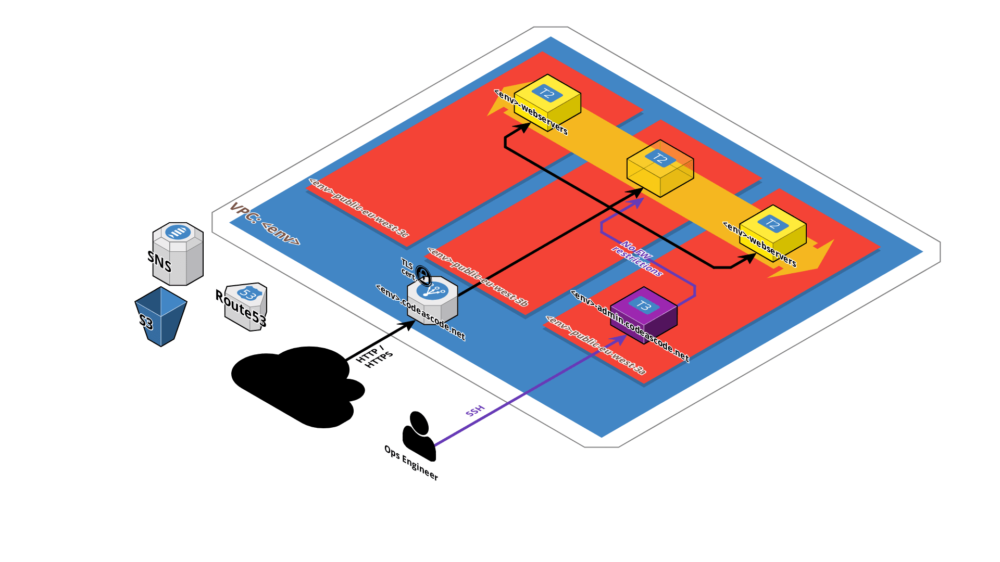

# terraform

## Introduction

Source: https://github.com/papaFrancky/terraform.git

Ce repository tire son nom de l'outil d'Infrastructure As Code (IAC) développé par la société [HashiCorp](https://www.hashicorp.com/): [terraform](https://www.terraform.io/).

Le présent code permet pour l'environnement choisi (\<env\>) [DEV|TST|ACC|PRD] la création :
* d'un VPC nommé \<env\>;
* d'une instance EC2 dédiée à l'administration et utilisée comme 'Jump Host';
* d'un Load-Balancer Applicatif (ALB);
* d'un Auto Scaling Group (ASG) permettant le déploiement de serveurs web.

## La 'big picture'

Dans un VPC dédié à l'environnement qui nous intéresse (DEV|TST|ACC|PRD), nous avons créé :

## Avant de commencer

Un certain nombre de prérequis doit être satisfaits avant de commencer :

### Paire de clés SSH
Vous devrez disposer avant de commencer les déploiements d'une paire de clés pour les serveurs web et une autre pour l'instance d'admin (EC2 / Network & Security / Key pairs).

Module|variable|valeur
:---:|:---:|:---:
admin-ec2-instance|ssh_key|admin
webservers|ssh_key|webservers

### Nom de domaine DNS
Notre instance d'admin et le load-balancer placé devant les instances 'webservers' seront accessibles depuis internet et utiliseront un nom de domaine que vous aurez pris soin de faire héberger sur AWS Route53.
Pour notre démo, nous utiliserons le nom de domaine suivant :

Domain Name|Hosted Zone ID
:---:|:---:
codeascode.net|Z12Y4ZPECZULO5

Notez qu'il vous faudra mettre à jour les fichiers suivants avec les valeurs correspondant à votre nom de domaine :

File|dns_domain_name|dns_zone_id
---|:---:|:---:
common/s3/admin/site.yml|X|
common/s3/webservers/site.yml|X|
modules/webservers/vars.tf|X|X
modules/load-balancer/vars.tf|X|

### Certificat X509
La génération et la gestion de vie d'un certificat est d'une simplicité déconcertante via le service [AWS Certificate Manager](https://aws.amazon.com/fr/certificate-manager/).
Pour autant sa validation peut prendre plusieurs heures aussi est-il préférable de le générer au préalable.

File|Variable|Description
---|---|---
modules/load-balancer/vars.tf|tls_certificate_arn|ARN du certificat X509

### Topic SNS
Nous souhaitons être **notifiés** lorsque des instances de webservers sont créées ou supprimées, soit parce qu'elles sont en mauvaise santé (health check), soit pour répondre à un pic de charge.

Pour ce faire, nous aurons défini au préalable un **topic SNS** (Simple Notification Service) nommé dans notre exemple *'codeascode-webservers-\<env\>'* et auquel nous aurons **souscrit** au moins une adresse email.

L'auto scaling group adressera ainsi les alertes aux adresses email rattachées.

### Code ansible
Lorsque les instances d'admin et les webservers seront lancées, elles récupéreront dans un bucket S3 du code ansible pour finaliser leur installation.
Il est donc primordial que ce code soit mis à jour et poussé sur le bucket avant de commencer les déploiements.
Voici comment procéder :

ansible code|working directory|push to S3 bucket
:---:|---|---
Admin instance|common/s3/admin|aws s3 sync . s3://\<s3_bucket\>/admin/ --exclude ".git/*" --exclude "*/.terraform/*" --delete
Webservers|common/s3/webservers|aws s3 sync . s3://\<s3_bucket\>/webservers/ --exclude ".git/*" --exclude "*/.terraform/*" --delete

__Notes:__ 
* Vous aurez besoin du client AWS CLI;
* Pour notre démo, nous utiliserons un bucket nommé *'demo-infra-s3-bucket'*.
* Les commandes de synchronisation du code dans le bucket S3 sont décrites dans les fichiers 'readme.md' présents avec le code ansible.

### Votre adresse IP
L'instance d'admin disposant de tous les privilèges dans AWS, il est préférable de restreindre son accès à l'adresse IP avec laquelle vous accédez à internet.
[Identifiez-la](https://www.whatsmyip.org/) et renseignez la variable suivante :

File|Variable
---|---
modules/admin-ec2-instance/vars.tf|my_own_ip_address

## Le VPC

### Description

Un VPC dédié sera créé pour chacun des environnements suivants:

Environnement|Développement|Tests|Acceptance|Production
:---:|:---:|:---:|:---:|:---:
\<env\>|dev|tst|acc|prd

Chaque VPC sera constitué de 2 subnets de types public et privé, tous 2 répartis sur les 3 Availability Zones (AZ) que compte la région Paris :
* **Public subnet** : nous créerons donc 3 subnets (un par AZ) avec des plages d'adresses IP qui ne se recouvrent pas et dont les tables de routage respectives auront pour passerelle par défaut une 'Internet Gateway' (internet facing);
* **Private subnet** : à l'instar du 'public subnet', il comptera lui aussi 3 subnets répartis chacun sur une AZ distincte et avec des plages d'adresses IP distinctes. La différence réside dans le fait que la passerelle par défaut de leur table de routage sera une NAT gateway (une par subnet).

Veuillez noter que la __création du subnet de type privé est optionnelle__ dans la mesure où elle a pour but d'héberger les middlewares et/ou backends ne devant pas être exposés directement à internet (bases de données, etc...). Notre code se contente ici de déployer des instances dans le subnet public aussi pouvons-nous nous en passer, ce qui est préférable car les NAT gateways ont un coût.

Si vous souhaitez créer le subnet privé, il vous suffit de renommer le fichier *'modules/vpc/private-subnet.tf.disabled'* en *'modules/vpc/private-subnet.tf'*.

vpc|region|availability zone|subnet type|subnet|cidr|gateway|internet facing
:---:|:---:|:---:|:---:|:---:|:---:|:---:|:---:
\<env\>|eu-west-3|eu-west-3a|public|\<env\>-public-eu-west-3a|10.0.101.0/24|\<env\>|yes
\<env\>|eu-west-3|eu-west-3b|public|\<env\>-public-eu-west-3b|10.0.102.0/24|\<env\>|yes
\<env\>|eu-west-3|eu-west-3c|public|\<env\>-public-eu-west-3c|10.0.103.0/24|\<env\>|yes
\<env\>|eu-west-3|eu-west-3a|private|\<env\>-private-eu-west-3a|10.0.201.0/24|\<env\>-eu-west-3a|no
\<env\>|eu-west-3|eu-west-3b|private|\<env\>-private-eu-west-3b|10.0.202.0/24|\<env\>-eu-west-3b|no
\<env\>|eu-west-3|eu-west-3c|private|\<env\>-private-eu-west-3c|10.0.203.0/24|\<env\>-eu-west-3c|no

### Création du VPC

**\<terraform_repository\>** = clone du repository 'terraform' (ex: /home/user/terraform)

**\<env\>** = environnement souhaité (dev, tst, acc, prd)

    cd <terraform_repository>/<env>/vpc
    terraform init
    terraform plan
    terraform apply --auto-approve

### Destruction du VPC

    cd <terraform_repository>/<env>/vpc
    terraform destroy --auto-approve

## L'instance EC2 d'administration

### Description

Les webservers que nous allons déployer plus tard ne seront accessibles depuis internet qu'en **http/80** et **https/443**.
Si nous souhaitons nous y connecter en **ssh/22**, nous devrons passer par l'instance d'administration dédiée à cet usage (Jump Host).

L'instance EC2 en question dispose de **privilèges étendus** (IAM policy: *'AdministratorAccess'*) lui permettant de disposer sans limites de tous les services proposés par AWS. 

Elle est par conséquent particulièrement sensible et pour éviter sa compromission, quelques règles d'usage s'imposent :
* son accès doit être **restreint** à l'adresse IP avec laquelle vous accéder à internet;
* si vous avez déployé les webservers et que vous ne faites pas usage de l'instance d'admin, **arrêtez-la** via la console (ou via API si vous préférez).
* si l'autoscaling group des webservers n'est pas déployé, **détruisez-la**.

### Création de l'instance EC2 d'administration

#### Configuration de l'instance

    cd <terraform_repository>/<env>/admin-ec2-instance
    vi main.tf

variable|description|type|default|example
---|---|:---:|:---:|:---:
my_own_ip_address|Adresse IP autorisée en SSH|string|"0.0.0.0/0"|"88.191.67.129/32"
instance_type|Type d'instance EC2|string|"t3.micro"|...

#### Création de l'instance

    cd <terraform_repository>/<env>/admin-ec2-instance
    terraform init
    terraform plan
    terraform apply --auto-approve

#### Arrêt de l'instance 

Pour l'heure, aucun script n'est fourni avec le code terraform pour arrêter l'instance en utilisant une API AWS. Vous devrez passer par la console AWS pour effectuer cette opération.

#### Destruction de l'instance 

    cd <terraform_repository>/<env>/admin-ec2-instance
    terraform destroy --auto-approve

Notez que vous ne devez pas supprimer l'instance d'administration si vous avez déployé les webservers ou si vous comptez le faire. En effet, son Security Group (SG) fait référence à celui de l'instance d'admin pour restreindre leur accès en SSH à cette dernière. Si vous vous trouvez dans ce cas de figure, préférez son extinction plutôt que sa suppression.

## Le Load-Balancer Applicatif (ALB)

### Description

L’équilibreur de charge d’application fonctionne au niveau des requêtes (couche 7), en acheminant le trafic vers les cibles, à savoir des instances EC2, des conteneurs, des adresses IP ou des fonctions Lambda, selon le contenu de la requête.

Pages de référence|URLs
:---:|---
Fonctionnalités d’Elastic Load Balancing|https://aws.amazon.com/fr/elasticloadbalancing/features/
Qu'est-ce qu'un Application Load Balancer ?|https://docs.aws.amazon.com/fr_fr/elasticloadbalancing/latest/application/introduction.html

### Mise en oeuvre

Notre site internet répondra en HTTPS/443 comme tous les sites le font aujourd'hui.
Le trafic HTTP/80 sera quant à lui redirigé sur le site HTTPS/443.

L'implémentation est la suivante:

Listener|Règle
---|---
HTTP:80| redirection du trafic sur le listener HTTP:443
HTTPS:443| le trafic est transféré au 'target group' webservers

Target group|le trafic 
---|---
webservers|le trafic est envoyé en HTTP sur le port 80 aux instances qu'il regroupe

Pour résumer, le load-balancer applicatif reçoit en entrée du trafic HTTPS et le transmet en HTTP au target group auquel sera rattaché l'auto scaling d'instances webservers.

Bien entendu, pour supporter le HTTPS, nous devrons lui rattacher le certificat X509 correspondant au nom de domaine de notre site (cf. AWS Certificate Manager).

## L'auto-scaling group de webservers

L'auto scaling group est notre pièce maîtresse : c'est grâce à ce dernier que nous pourrons adapter nos ressources (ie. le nombre d'instances EC2 webservers) pour répondre à un pic de consultation de notre site web.

Liens utiles :

Page|URL
---|---
AWS auto Scaling|https://aws.amazon.com/fr/autoscaling/
Amazon EC2 Auto Scaling|https://aws.amazon.com/fr/ec2/autoscaling/?sc_channel=ba&sc_campaign=autoscaling-ec2-button&sc_medium=button&sc_country=global&sc_geo=global&sc_outcome=aware

### Personnalisation de l'auto scaling group

Nous pouvons configurer notre auto scaling group avec les variables décrites dans le tableau ci-dessous et présentes dans le fichier :

\<env\>/webservers/main.tf

Variable|Description|Example
---|---|---
instance_type|type d'instance EC2|t2.nano
nb_servers_min|nombre d'instances EC2 minimum|1
nb_servers_max|nombre d'instances EC2 maximum|6
use_prod_cname|si PRD: 'www.\<domain_name\>'; sinon: '\<env\>.\<domain_name\> |dev.codeascode.net
sns_topic|topic SNS créé pour les notifications par mail|codeascode-webservers-dev

### Définition de la Launch Configuration
La 'launch config.' définit l'instance EC2 qui sera gérée par l'auto scaling group : 
* AMI
* type d'instance
* paire de clés SSH associée
* rôle IAM (instance profile)
* adresse IP publique ?
* script de bootstrap (user-data)
* ...

Notes : 

Le user-data est exactement le même que celui utilisé par l'instance d'administration : il se contente d'installer ansible, de récupérer du code ansible dans un sous-répertoire de notre bucket S3, et de l'exécuter pour finaliser l'installation de l'instance (en l'occurrence, installer un serveur Apache et créer une page d'index contenant des méta-données).

A l'instar de l'instance d'administration, le code ansible doit être déployé dans le bucket S3 avant de créer l'auto scaling group. Pour ce faire, procédez comme suit :

    cd <terraform_repository>/common/s3/webservers
    aws s3 sync . s3://<bucket_name>/webservers/   \
        --exclude ".git/*"                         \
        --exclude "*/.terraform/*"                 \
        --delete

### Définition de l'Auto Scaling Group (ASG)

#### Target Group du Load Balancer
L'Auto Scaling Group fait la jonction avec la Launch Configuration et le Target Group du Load Balancer que nous avons créé plus tôt. Son Listener **HTTPS:443** transfèrera les flux au Target Group qui contiendra un nombre d'instances EC2 compris entre le nombre minimum et maximum d'instances de l'auto scaling group.

#### Fail Over
L'ASG définit également un certain nombre de métriques que nous souhaitons voir remontés dans le service de monitoring Amazon CloudWatch, et précisera aussi que le mécanisme de 'health check' sera confié au Load Balancer.

Si ce dernier constate qu'une instance ne répond pas comme attendu en HTTP:80/, ce dernier en informera l'Auto Scaling Group qui remplacera la ou les instances concernées.

#### Scaling

##### Scaling up
Si le taux d'utilisation de la CPU dépasse en moyenne 50% pour l'ensemble de l'Auto Scaling Group sur 2 relevés CloudWatch consécutifs pris sur un interval de 2 minutes, alors une instance EC2 supplémentaire est ajoutée à l'Auto Scaling Group si le nombre maximum d'instances n'est pas encore atteint.

##### Scaling down
Si en revanche le taux d'utilisation de la CPU passe en-dessous des 10% pour l'ensemble de l'Auto Scaling Group (et mesuré 2 fois de suite avec un interval de temps de 2 minutes), alors l'Auto Scaling Group détruira une instance EC2 si le nombre minimum d'instances n'est pas encore atteint.

### Notifications par email

Notre Auto Scaling Group adressera un email aux souscripteurs du topic SNS créé préalablement (et identifié par la variable 'sns_topic') chaque fois qu'une nouvelle instance sera ajoutée ou supprimée.

### Nom de domaine DNS

Enfin, nous devons garder à l'esprit la finalité de cet exercice reste la mise en place d'un site web :)

Nous créerons en conséquence un alias DNS (CNAME) qui pointera vers le Load-Balancer :

Environment| DNS alias
---:|---
DEVELOPMENT|dev.\<domain_name\>
TEST|tst.\<domain_name\>
ACCEPTANCE|acc.\<domain_name\>
PRODUCTION|www.\<domain_name\>

______________________________________________________________________________

## Tests de charge

### Fail over
Si une ou plusieurs instances EC2 venait à dysfonctionner (ie. à ne plus répondre correctement aux requêtes http/80), le load-balancer en informerait l'auto-scaling group qui procéderait alors à son/leur remplacement.

#### *Modus Operandi*
Depuis l'instance d'administration :

    sudo rpm -ivh http://dl.fedoraproject.org/pub/epel/6/x86_64/epel-release-6-8.noarch.rpm
    sudo yum install siege
    siege -b -c 150 https://dev.codeascode.net/phpinfo.php

### Scaling up et down

Dans notre exemple, nous souhaitons d'augmenter de 1 le nombre d'instances EC2 de notre auto-scaling group si la moyenne de consommation CPU dépassait les 50% sur 2 périodes consécutives de 2 minutes.

A l'inverse, si la moyenne de la consommation CPU des instances de l'auto-scaling group baissait en-dessous des 10% pendant 2 périodes consécutives de 2 minutes, 1 instance serait 'terminée'.

Ces 2 alarmes définies et rattachées à l'auto-scaling group dans le service de monitoring CloudWatch. C'est ce service qui informera l'auto-scaling de la nécessité d'augmenter ou bien de réduire le nombre d'instances, et non le load-balancer comme ce fut le cas pour le fail-over. 

#### *Modus Operandi*
Se loguer depuis l'instance d'admin sur l'adresse __IP privée(!)__ des instances webservers et exécuter en background la commande suivante qui devrait faire monter singificativement la charge CPU :

    yes > /dev/null &
    top

Faire monter la CPU sur les 2 instances jusqu'à déclencher l'alarme.
